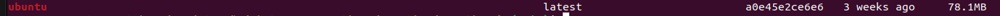

# Practica 4b
## Teoría Docker

### 1.  Utilizando sus palabras, describa qué es Docker y enumere al menos dos beneficios que encuentre para el concepto de contenedores.  
**Docker** es una plataforma que **permite crear, distribuir y ejecutar aplicaciones dentro de contenedores. Un contenedor es una unidad ligera, portátil y aislada que empaqueta una aplicación junto con todas sus dependencias (librerías, archivos, configuraciones del sistema) para que se pueda ejecutar de forma consistente en cualquier entorno, ya sea en desarrollo, pruebas o producción.**  
Docker se basa en funcionalidades del sistema operativo, como los **namespaces** y **cgroups** del kernel de Linux, para lograr el aislamiento y control de recursos de los contenedores, **sin necesidad de virtualizar un sistema operativo completo** (como sí lo haría una máquina virtual).  
<br>

Dos beneficios principales del uso de contenedores (como los que gestiona Docker):  
- ***Portabilidad:*** Como el contenedor incluye todo lo necesario para ejecutar la aplicación, puede moverse entre distintos entornos (de tu máquina local a un servidor, de desarrollo a producción) sin que el comportamiento cambie.
- ***Aislamiento y eficiencia:*** Cada contenedor se ejecuta de manera aislada, evitando conflictos entre aplicaciones o versiones de librerías, y además consume menos recursos que una máquina virtual, ya que comparte el kernel del sistema anfitrión.

### 2.  ¿Qué  es  una  imagen?  ¿Y  un  contenedor?  ¿Cuál  es  la  principal  diferencia  entre ambos?  
***Imagen:***  
Es un archivo inmutable que contiene todo lo necesario para ejecutar una aplicación: código, bibliotecas, dependencias, variables de entorno y configuraciones. Es como una plantilla o fotografía congelada del entorno de ejecución. Las imágenes se construyen (por ejemplo, con un **Dockerfile**) y se almacenan en registros como Docker Hub.

***Contenedor:***  
Es una **instancia en ejecución de una imagen**. Al igual que un proceso, un contenedor es algo dinámico y efímero: se puede iniciar, detener, pausar o eliminar. Es el entorno de ejecución aislado que realmente corre en tu máquina, utilizando la imagen como base.

<u>Principal diferencia:</u>  
- Una **imagen** es <u>estática y representa la configuración</u>
- Un **contenedor** es <u>dinámico, es la imagen ejecutándose con su propio sistema de archivos, PID, red, etc</u>.

### 3.  ¿Qué es Union Filesystem? ¿Cómo lo utiliza Docker?  
**Union Filesystem (UnionFS)** es un tipo especial de sistema de archivos que permite superponer múltiples sistemas de archivos en capas, creando una única vista coherente de todas ellas.  
**Docker utiliza UnionFS para construir sus imágenes por capas**. Cada instrucción en un **Dockerfile** (como `RUN`, `COPY`, `ADD`) genera una nueva capa de solo lectura que se apila sobre la anterior. Al crear un contenedor a partir de esa imagen, Docker agrega una capa adicional de escritura en la parte superior, que permite modificar archivos sin alterar las capas inferiores.

<u>Este enfoque tiene varias ventajas:</u>
- **Reutilización de capas:** Si dos imágenes comparten una misma base (por ejemplo, python:3.10), Docker no la descarga dos veces.
- **Eficiencia:** Solo se almacenan y transfieren las capas que cambian.
- Inmutabilidad: Las capas inferiores no se modifican, lo que mejora la estabilidad y coherencia.

### 4.  ¿Qué rango de direcciones IP utilizan los contenedores cuando se crean? ¿De dónde la obtiene?  
Generalmente, Docker utiliza un rango de direcciones IP privadas definido por el estándar `RFC 1918`. El rango más común que usa para la red bridge es `172.17.0.0/16`.  
Docker utiliza un **servidor DHCP interno gestionado por el motor de Docker**, que asigna direcciones IP desde el rango definido al momento de crear una red. En el caso de la red bridge predeterminada, este rango está preconfigurado por Docker al instalarse.

### 5.  ¿De qué manera puede lograrse que las datos sean persistentes en Docker? ¿Qué dos maneras hay de hacerlo? ¿Cuáles son las diferencias entre ellas?  
En Docker, los datos que se generan dentro de un contenedor no son persistentes por defecto. Si el contenedor se elimina, también se pierden esos datos. Para evitarlo, **se pueden usar volúmenes o bind mounts, que permiten persistencia y reutilización de datos**.  
1. ***Volúmenes de Docker***
- Son gestionados por Docker.
- Se almacenan en un directorio específico del host (como `/var/lib/docker/volumes/`).
- Se crean con docker volume create o directamente al lanzar un contenedor con `-v volumen:/ruta/en/contenedor`.
- Son portables entre contenedores y fáciles de respaldar.
- <u>**Ventajas**:</u>  
  - Mayor seguridad (no se expone una ruta del host).
  - Independencia del sistema de archivos del host.
  - Mejor rendimiento y flexibilidad, especialmente en entornos con múltiples contenedores.

1. ***Bind mounts (montajes vinculados)***
- Utilizan un directorio o archivo real del host y lo montan dentro del contenedor.
- Se definen así: `-v /ruta/host:/ruta/contenedor`
- Son útiles para desarrollo, porque permiten editar archivos en el host y ver cambios reflejados en tiempo real dentro del contenedor.
- <u>**Ventajas**:</u>  
  - Mayor control directo sobre los archivos.
  - Muy útil para desarrollo con sincronización entre host y contenedor.


## Práctica Docker

### 2

- **a.  Obtener una imagen de la última versión de Ubuntu disponible. ¿Cuál es el tamaño en disco de la imagen obtenida? ¿Ya puede ser considerada un contenedor? ¿Qué significa lo siguiente: Using default tag: latest?**  
  - Para obtener la última version de Ubuntu disponible utilizamos el comando `docker pull ubuntu`
  - para ver el tamaño de la imagen usamos el comando `docker images | grep ubuntu`
  -   
  - Una imagen no es un contenedor: es solo una plantilla. Para tener un contenedor, hay que instanciar la imagen con `docker run ubuntu`
  - "Using default tag: latest" significa que, al no especificar una versión, Docker usa la etiqueta latest.

- b.  De  la  imagen  obtenida  en  el  punto  anterior  iniciar  un  contenedor  que simplemente ejecute el comando  ls -l. 

- **c.  ¿Qué sucede si ejecuta el comando docker [container] run ubuntu /bin/bash1? ¿Puede utilizar la shell Bash del contenedor?**   
al ejecutar el comando `docker run ubuntu /bin/bash1` obtengo un error ya que no existe el comando bash1, no encuentra sus binarios en /usr/bash1
  - **i.  Modifique  el  comando utilizado para que el contenedor se inicie con una terminal interactiva y ejecutarlo. ¿Ahora puede utilizar la shell Bash del contenedor? ¿Por qué?** 
    - Si, ahora puedo utilizarlo, no solo porque existe el binario en /bin/bash, sino que ademas se mantiene abierta la terminal interactiva a través del comando `docker run -it ubuntu /bin/bash`
  - **ii.  ¿Cuál es el PID del proceso bash en el contenedor? ¿Y fuera de éste?**
    - dentro del contenedor el proceso bash tiene el `PID 1`, pero fuera del contenedor el bash tiene `PID 34096` que es como lo ve el host.
  - **iii.  Ejecutar el comando lsns. ¿Qué puede decir de los namespace?**
    - ```bash
        root@0d1c2f0f5422:/# lsns
        NS         TYPE   NPROCS PID USER COMMAND
        4026531834 time        2   1 root /bin/bash
        4026531837 user        2   1 root /bin/bash
        4026532772 mnt         2   1 root /bin/bash
        4026532773 uts         2   1 root /bin/bash
        4026532774 ipc         2   1 root /bin/bash
        4026532775 pid         2   1 root /bin/bash
        4026532776 cgroup      2   1 root /bin/bash
        4026532777 net         2   1 root /bin/bash
        ```
    - acá vemos los namespaces a los que pertenece el proceso `PID 1` dentro de ese contenedor (que corre /bin/bash).
  - **iv.  Dentro  del  contenedor  cree  un  archivo  con  nombre sistemas-operativos  en  el  directorio raíz del filesystem y luego salga del contenedor (finalice la sesión de Bash utilizando las teclas Ctrl + D o el comando exit).**
    
  - **v.  Corrobore si el archivo creado existe en el directorio raíz del sistema operativo anfitrión (host). ¿Existe? ¿Por qué?** 
    - Como no declaramos volumenes ni nada, no logramos persistir los datos generados por el contenedor, entonces no los vemos en el so host.

- **d.  Vuelva a iniciar el contenedor anterior utilizando el mismo comando (con una terminal interactiva). ¿Existe el archivo creado en el contenedor? ¿Por qué?**
  - Como no declaramos volumenes ni nada no logramos persistir los datos generados por el contenedor, entonces al volver a instanciarlo se borran los datos.
 
- **e.  Obtenga el identificador del contenedor (container_id) donde se creó el archivo y utilícelo para iniciar con el comando docker start -ia container_id el contenedor en el cual se creó el archivo.** 
  - **i.  ¿Cómo obtuvo el container_id para para este comando?** 
    - para obtener el container_id utilizamos el comando `docker ps -a` para listar todos los contenedores y lo buscamos por nombre, asociado estara el id.
    - si utilizamos solo `docker ps` solo vemos los contenedores en ejecucion, con el flag `-a` vemos los que estan detenidos
  - **ii.  Chequee nuevamente si el archivo creado anteriormente existe. ¿Cuál es el resultado en este caso? ¿Puede encontrar el archivo creado?** 
    - En este caso con el comando `docker start -ai <container_id>` podemos reiniciar un contenedor detenido, en este caso si podemos ver el archivo porque sería la misma instancia del contenedor donde se creo el archivo respectivamente.

- **f.  ¿Cuántos contenedores están actualmente en ejecución? ¿En qué estado se encuentra cada uno de los que se han ejecutado hasta el momento?** 
  - En este momento no hay contenedores en ejecucion (para ejecutar `docker ps`) debemos salir del contenedor en si, y no tenemos otros instanciados.
- **g.  Elimine todos los contenedores creados hasta el momento. Indique el o los comandos utilizados.** 
  - **<u>Como no lo hago en la VM de la cátedra solo voy a eliminar los contenedores de ubuntu</u>**
  - en mi caso utilizo este, `docker ps -a --filter ancestor=ubuntu -q | xargs docker rm`
  - **Si quisiera eliminar todos los contenedores indistintamente tendria que:**
  - para listar los id's de contenedores uso el comando `docker ps -aq`
  - para eliminarlos uso el comando `docker rm <container_id>`
  - y entre ambos elimino todo en un solo comando `docker rm $(docker ps -aq)`
`


### 3.  Creación  de  una  imagen  a  partir  de un contenedor. Siguiendo los pasos indicados a continuación genere una imagen de Docker a partir de un contenedor: 
- **a.  Inicie  un  contenedor  a  partir  de  la  imagen  de  Ubuntu  descargada anteriormente ejecutando una consola interactiva de Bash.** 

- **b.  Instale el servidor web Nginx, https://nginx.org/en/, en el contenedor utilizando los siguientes comandos:** 
`export DEBIAN_FRONTEND=noninteractive`
`export TZ=America/Buenos_Aires`
`apt update -qq`
`apt install -y --no-install-recommends nginx`

- **c.  Salga del contenedor y genere una imagen Docker a partir de éste. ¿Con qué nombre se genera si no se especifica uno?** 
  - por defecto se crearia con el nombre <none>, para evitar esto usamos el comando
  - `docker commit <container_id> <nombre_container>`

- **d.  Cambie  el  nombre  de  la  imagen  creada  de  manera  que  en  la  columna Repository aparezca nginx-so y en la columna Tag aparezca v1.** 
  - para aclarar el nombre y tag, hariamos algo como `docker commit container_id nginx.so:v1`, el nombre sería `nginx-so`, y el tag `v1`
  - si lo creamos sin el nombre y quisieramos modificarlo sería `docker tag <image_id> nginx-so:v1` 

- **e.  Ejecute un contenedor a partir de la imagen nginx-so:v1 que corra el servidor web nginx atendiendo conexiones en el puerto 8080 del host, y sirviendo una página web para corroborar su correcto funcionamiento. Para esto:** 

  - **i.  En  el  Sistema  Operativo  anfitrión  (host)  sobre  el  cual  se  ejecuta Docker crear un directorio que se utilizará para este taller. Éste puede ser el directorio nginx-so dentro de su directorio personal o cualquier otro directorio - para los fines de este enunciado haremos referencia a éste  como  /home/so/nginx-so,  por  lo  que  en  los  lugares  donde  se mencione esta ruta usted deberá reemplazarla por la ruta absoluta al directorio que haya decidido crear en este paso.**
    -  
  - **ii.  Dentro  de  ese  directorio,  cree  un  archivo  llamado  index.html  que contenga  el  código  HTML  de  este  gist  de  GitHub: https://gist.github.com/ncuesta/5b959fce1c7d2ed4e5a06e84e5a7efc8.**
    -  
  - **iii.  Cree  un  contenedor  a  partir  de  la  imagen  nginx-so:v1  montando  el directorio  del  host  (/home/so/nginx-so)  sobre  el  directorio /var/www/html del contenedor, mapeando el puerto 80 del contenedor al  puerto  8080  del  host,  y  ejecutando  el  servidor  nginx  en  primer plano. Indique el comando utilizado.**
    - ```docker
        docker run --name nginx-so-test \
        -p 8080:80 \
        -v /home/so/nginx-so:/var/www/html \
        nginx-so:v1 \
        nginx -g 'daemon off;'
        ```
    - `--name nginx-so-test`: le da un nombre al contenedor.
    - `-p 8080:80`: redirige el puerto 8080 del host al 80 del contenedor (donde escucha Nginx).
    - `-v /home/so/nginx-so:/var/www/html`: monta el directorio del host en el lugar donde Nginx sirve los archivos.
    - `nginx-so:v1`: nombre y versión de la imagen que creaste.
    - `nginx -g 'daemon off;'`: arranca Nginx en primer plano (fundamental para que el contenedor no se cierre automáticamente).

- **f.  Verifique  que  el  contenedor  esté  ejecutándose  correctamente  abriendo  un navegador web y visitando la URL http://localhost:8080.** 

- **g.  Modifique el archivo index.html agregándole un párrafo con su nombre y número  de  alumno. ¿Es necesario reiniciar el contenedor para ver los cambios?**
  - no, ya que montamos el volumen en la ruta `/home/so/nginx-so:/var/www/html`

- **h.  Analice: ¿por qué es necesario que el proceso nginx se ejecute en primer plano? ¿Qué ocurre si lo ejecuta sin -g 'daemon off;'?** 
  - Al usar `docker run`, Docker espera que el proceso principal del contenedor (el que se define en el comando final) se mantenga ejecutándose en primer plano. Si ese proceso termina, Docker asume que el contenedor debe finalizar.
  - Por defecto, nginx corre en modo daemon, es decir, se va al **background**. Entonces, si lo ejecutás sin la opción: `nginx -g 'daemon off;'`, el proceso padre termina inmediatamente (porque nginx se va al background), y Docker para el contenedor porque piensa que terminó la tarea.


### 4. Creación de una imagen Docker a partir de un archivo Dockerfile. Siguiendo los pasos indicados  a  continuación,  genere  una  nueva  imagen  a  partir  de  los  pasos  descritos  en  un Dockerfile. 
- a.  En el directorio del host creado en el punto anterior (/home/so/nginx-so), cree un archivo Dockerfile que realice los siguientes pasos: 
  - i.  Comenzar en base a la imagen oficial de Ubuntu. 
  - ii.  Exponer el puerto 80 del contenedor. 
  - iii.  Instalar el servidor web nginx. 
  - iv.  Copiar el archivo index.html del mismo directorio del host al directorio /var/www/html de la imagen. 
  - v.  Indicar el comando que se utilizará cuando se inicie un contenedor a partir de esta imagen para ejecutar el servidor nginx en primer plano: nginx -g 'daemon off;'. Use la forma exec4 para definir el comando, de manera que todas las señales que reciba el contenedor sean enviadas directamente al proceso de nginx. Ayuda: las instrucciones necesarias para definir los pasos en el Dockerfile son FROM, EXPOSE, RUN, COPY y CMD. 
```Dockerfile
FROM ubuntu:latest

EXPOSE 80

RUN apt update -qq && apt install -y --no-install-recommends nginx \
    && rm -rf /var/lib/apt/lists

COPY index.html /var/www/html/index.html

CMD ["nginx", "-g", "daemon off;"]
```

- **b.  Utilizando el Dockerfile que generó en el punto anterior construya una nueva imagen Docker guardándola localmente con el nombre nginx-so:v2.**
  -  parado en el mismo lugar donde estar el `Dockerfile`
  -  `docker build -t nginx-so:v2 .` *(creo la nueva imagen "nginx-so v2")*

- **c.  Ejecute un contenedor a  partir de la nueva imagen creada con las opciones adecuadas para que pueda acceder desde su navegador web ala página a través del puerto 8090 del host. Verifique que puede visualizar correctamente la página accediendo a http://localhost:8090.** 
  - `docker run --name nginx-so-v2 -p 8090:80 nginx-so:v2` *(instancio el contenedor)*

- **d.  Modifique el archivo index.html del host agregando un párrafo con la fecha actual y recargue la página en su navegador web. ¿Se ven reflejados los cambios que hizo en el archivo? ¿Por qué?** 
  - No se ven reflejados los cambios, porque el index.html fue copiado dentro de la imagen durante el docker build, y el contenedor lo usa desde su sistema de archivos interno. No está vinculado con el archivo real del host, así que cualquier cambio en tu archivo index.html no afecta al contenedor.

- **e.  Termine el contenedor iniciado antes y cree uno nuevo utilizando el mismo comando. Recargue la página en su navegador web. ¿Se ven ahora reflejados los cambios realizados en el archivo HTML? ¿Por qué?** 
  - `docker ps -a` *(para ubicar <contenedor_id>)*
  - `docker rm <contenedor_id>` *(para eliminar el contenedor)*
  - `docker run --name nginx-so-v2 -p 8090:80 nginx-so:v2` *(instancio el contenedor)*
  - No se ven reflejados los cambios porque sigue usando la misma imagen `nginx-so:v2`, que fue creada antes de modificar el HTML. Aunque el contenedor es nuevo, el contenido ya estaba dentro de la imagen 

- **f.  Vuelva a construir una imagen Docker a partir del Dockerfile  creado anteriormente, pero esta vez dándole el nombre nginx-so:v3. Cree un contenedor a partir de ésta y acceda a la página en su navegador web. ¿Se ven reflejados los cambios realizados en el archivo HTML? ¿Por qué?**
  - `docker build -t nginx-so:v3 .` *(creo la nueva imagen "nginx-so v3")*
  - Si, se ve reflejado el cambio, porque esta vez el archivo HTML actualizado fue copiado durante el build, al crear la nueva imagen. Así, el contenedor de v3 tiene ese nuevo contenido embebido.


